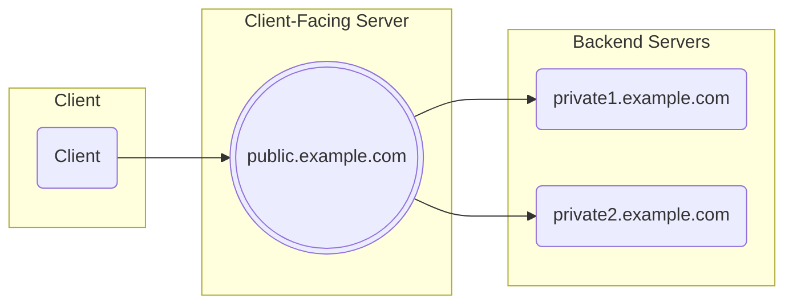

# Encrypted Client Hello with Split Mode Topology

This repo implements a go library to support Encrypted Client Hello with a Split Mode Topology, as described in https://datatracker.ietf.org/doc/draft-ietf-tls-esni/



The ECH library handles the Client-Facing Server part. A `ech.Conn` transparently inspects the TLS handshake and decrypts/decodes Encrypted Client Hello messages. The decoded ServerName and/or ALPN protocols can then be used to route the TLS connection to the right backend server.

The [example](https://github.com/c2FmZQ/ech/tree/main/example) directory has working client and server examples.

The server code looks something like this:
```go
        ln, err := net.Listen("tcp", *addr)
        if err != nil {
                // ...
        }
        defer ln.Close()
        for {
                serverConn, err := ln.Accept()
                if err != nil {
                        // ...
                }
                go func() {
                        ctx, cancel := context.WithTimeout(context.Background(), 5*time.Second)
                        defer cancel()
                        conn, err := ech.NewConn(ctx, serverConn, ech.WithKeys(echKeys))
                        if err != nil {
                                // ...
                                return
                        }
                        log.Printf("ServerName: %s", conn.ServerName())
                        log.Printf("ALPNProtos: %s", conn.ALPNProtos())

                        switch host := conn.ServerName(); host {
                        case "public.example.com":
                                server := tls.Server(conn, &tls.Config{
                                        Certificates:             []tls.Certificate{tlsCert},
                                        EncryptedClientHelloKeys: echKeys,
                                })
                                fmt.Fprintf(server, "Hello, this is public.example.com\n")
                                server.Close()
                        default:
                                server := tls.Server(conn, &tls.Config{
                                        Certificates: []tls.Certificate{tlsCert},
                                })
                                fmt.Fprintf(server, "Hello, this is %s\n", host)
                                server.Close()
                        }
                }()
        }
```
