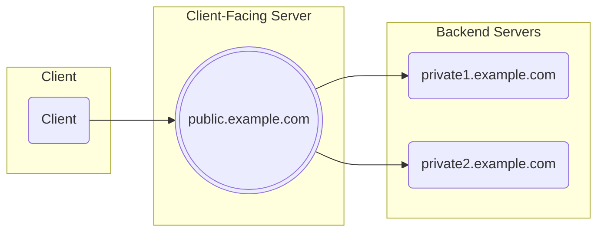

# Encrypted Client Hello with Split Mode Topology

This repo implements a go library to support Encrypted Client Hello with a Split Mode Topology.

The ECH library handles the Client-Facing Server part.

