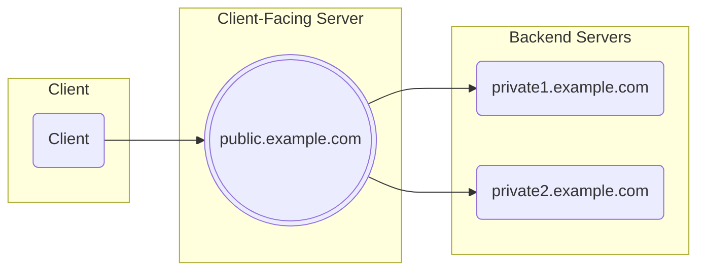

# Encrypted Client Hello with Split Mode Topology

This repo implements a library to support Encrypted Client Hello with a Split Mode Topology, along with secure client-side name resolution and network connections.

Split Mode Topology is defined in https://datatracker.ietf.org/doc/html/draft-ietf-tls-esni/#section-3.1

The ECH library handles the Client-Facing Server part. A `ech.Conn` transparently inspects the TLS handshake and decrypts/decodes Encrypted Client Hello messages. The decoded ServerName and/or ALPN protocols can then be used to route the TLS connection to the right backend server which terminates the TLS connection.

ECH Configs and ECH ConfigLists are created with `ech.NewConfig` and `ech.ConfigList`.

Clients can use `ech.Resolve` and/or `ech.Dial` to securely connect to services. They use RFC 8484 DNS-over-HTTPS (DoH) and RFC 9460 HTTPS Resource Records, along with traditional A, AAAA, CNAME records for name resolution. If a HTTPS record contains an ECH config list, it can be used automatically. `ech.Dial` also supports concurrent connection attempts to gracefully handle slow or unreachable addresses.

The [example](https://github.com/c2FmZQ/ech/tree/main/example) directory has working client and server examples.

See the [godoc](https://pkg.go.dev/github.com/c2FmZQ/ech) for more details.
