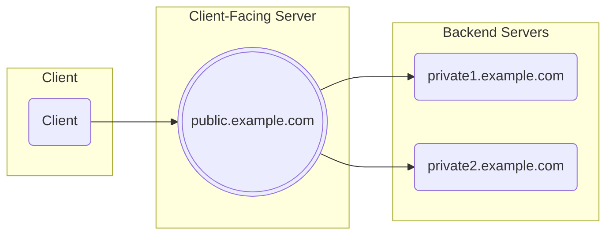

# Encrypted Client Hello with Split Mode Topology

This repo implements a go library to support Encrypted Client Hello with a Split Mode Topology, as described in https://datatracker.ietf.org/doc/html/draft-ietf-tls-esni/

The ECH library handles the Client-Facing Server part. A `ech.Conn` transparently inspects the TLS handshake and decrypts/decodes Encrypted Client Hello messages. The decoded ServerName and/or ALPN protocols can then be used to route the TLS connection to the right backend server.

The [example](https://github.com/c2FmZQ/ech/tree/main/example) directory has working client and server examples.

See the [godoc](https://pkg.go.dev/github.com/c2FmZQ/ech) for more details.
